# PiMatch

A PhD advisor (PI) matchmaking platform for graduate school applicants. PiMatch ranks Principal Investigators by research fit, mentorship style, funding stability, and personal connections — and lets students have a live conversation with an AI avatar of any matched professor before sending a single email.

Built for **Hacktech 2026**, targeting two tracks:
- **"Not So Sexy"** — solving a real, unglamorous logistics problem in academia
- **Listen Labs: Simulate Humanity** — AI avatars grounded in real survey data from professors and their students

**Live demo: [pimatch.tech](https://pimatch.tech)**

---

## Screenshots

### Landing
<table>
  <tr>
    <td>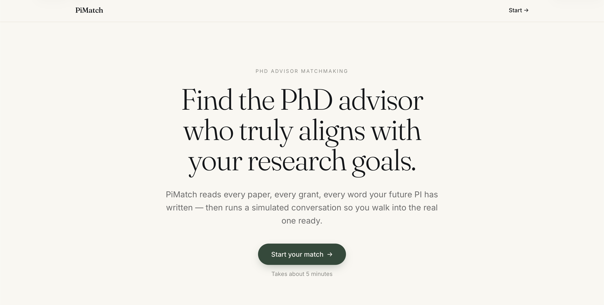</td>
    <td>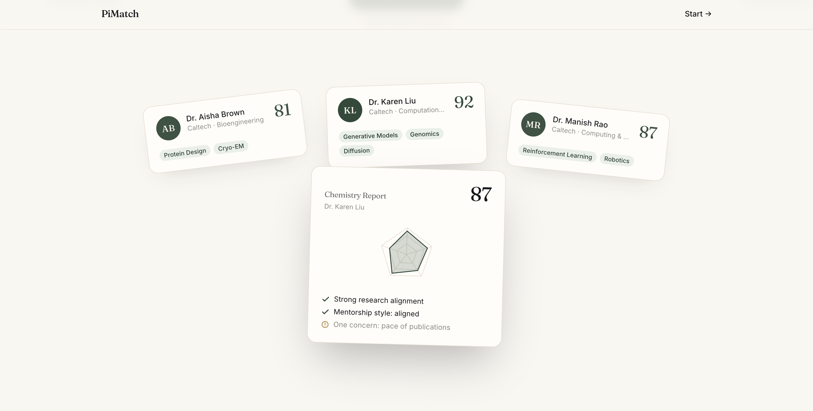</td>
  </tr>
  <tr>
    <td>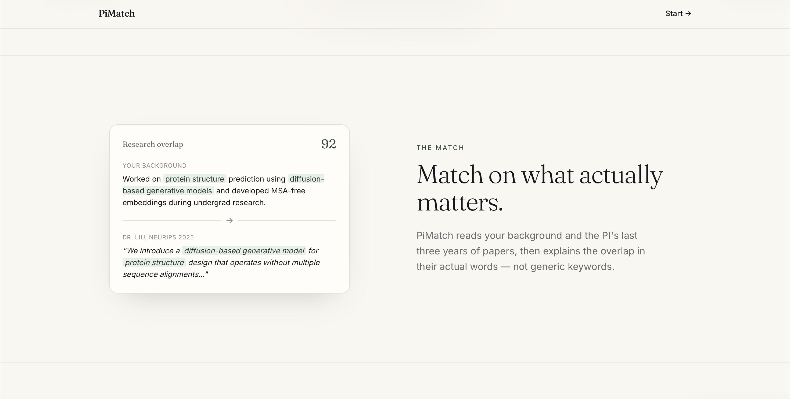</td>
    <td>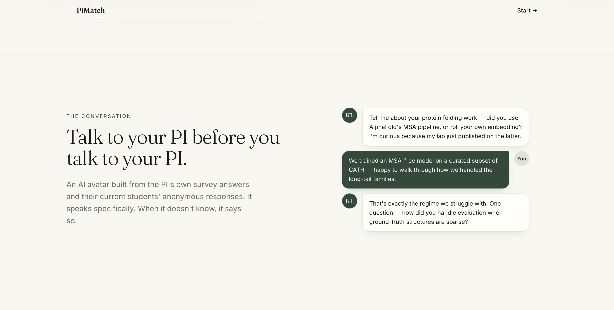</td>
  </tr>
  <tr>
    <td colspan="2">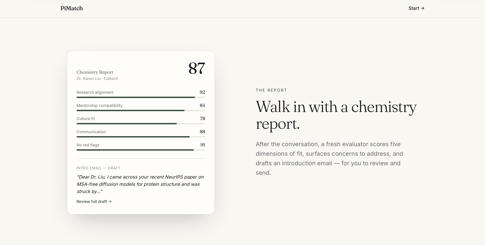</td>
  </tr>
</table>

### Ranked matches
<table>
  <tr>
    <td>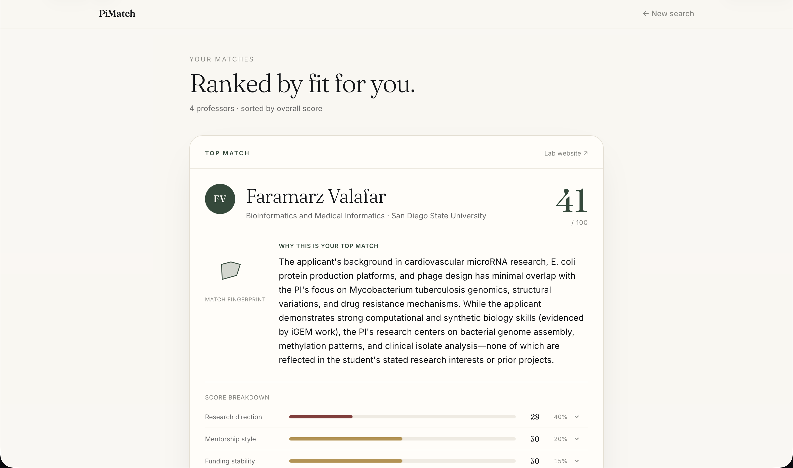</td>
    <td>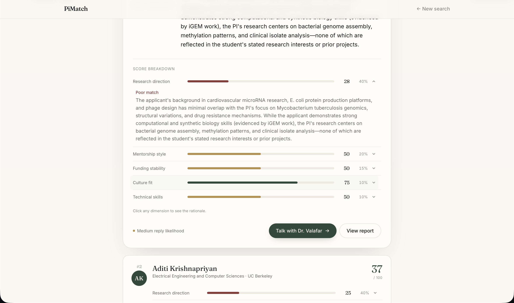</td>
  </tr>
</table>

### Live conversation with the PI avatar
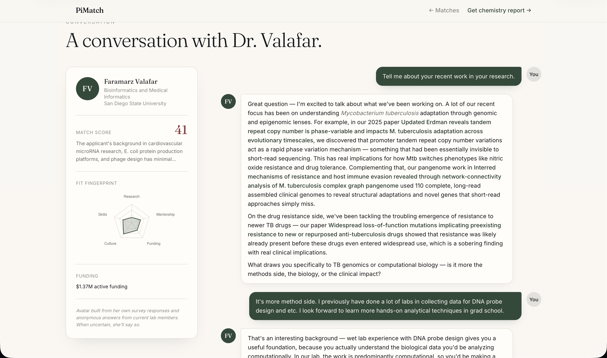

### Chemistry Report
<table>
  <tr>
    <td>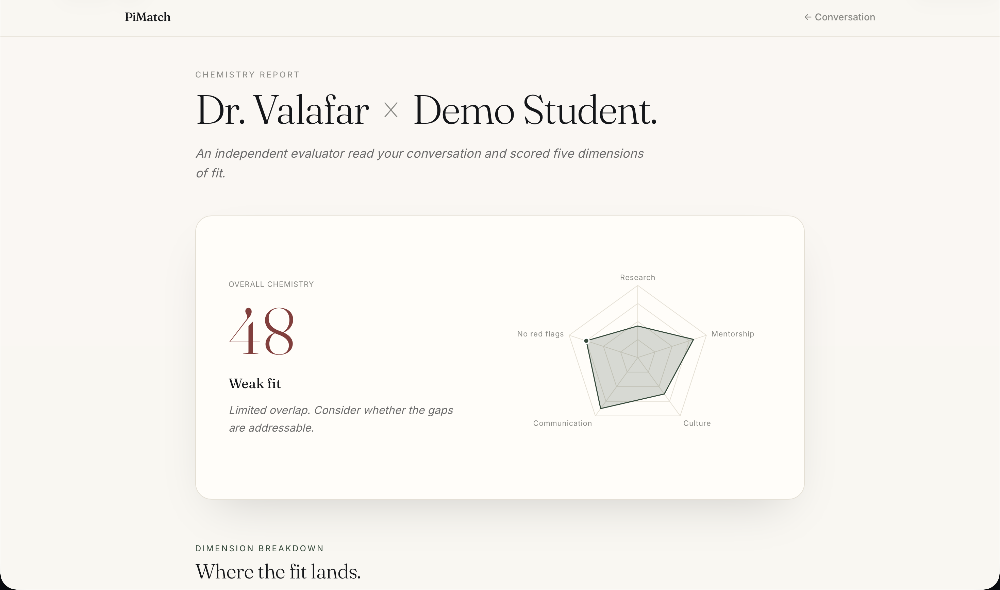</td>
    <td>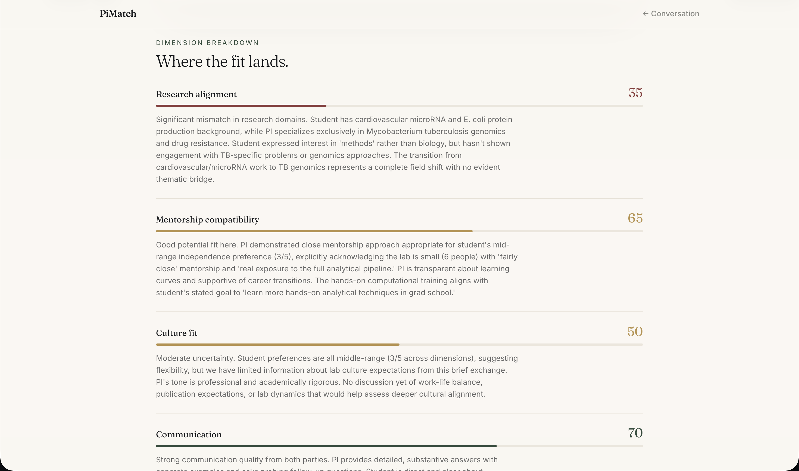</td>
  </tr>
  <tr>
    <td colspan="2">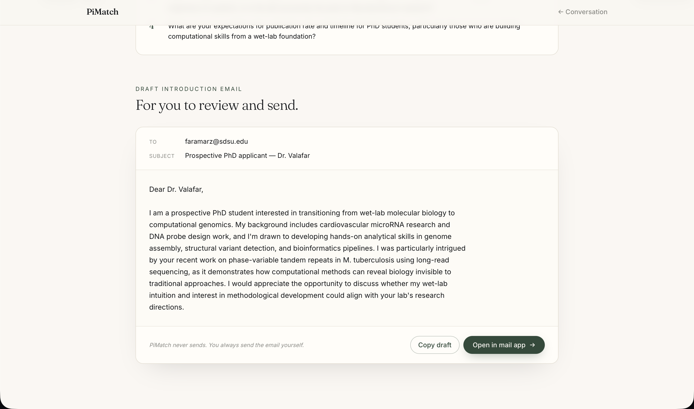</td>
  </tr>
</table>

---

## Team

- **Olivia Yan** — [@oyan](https://github.com/oyan)
- **Sarah Liu** — [@saraliu](https://github.com/saraliu)
- **Ruiyang (Ray) Ma** — [@rma29](https://github.com/rma29)
- **Chun-Yu (Alex) Chen** — [@A1ex-Ch3n](https://github.com/A1ex-Ch3n)

---

## What it does

1. **Structured intake** — students submit research background, mentorship preferences, citizenship status, and known professors.
2. **Ranked matches** — PIs are scored across five weighted dimensions: research direction (40%), mentorship style (20%), funding stability (15%), technical skills (10%), and culture fit (10%). Direct and indirect connections are surfaced; citizenship-restricted funding is flagged.
3. **AI avatar conversation** — students chat live with a PI avatar built from the professor's own survey, anonymized current-student feedback, and real published abstracts. The avatar cites real papers and grants, never fabricates.
4. **Chemistry Report** — after the conversation, a fresh evaluator scores fit across five dimensions, extracts key positives and concerns from the transcript, and drafts a personalized introduction email the student can review and send.

---

## Tech stack

| Layer | Choice |
|---|---|
| Backend | Python + FastAPI + SQLModel (SQLite) |
| LLM | Anthropic Claude (`claude-sonnet-4-5`) |
| Frontend | React + Vite + TypeScript + Tailwind |
| Charts | Recharts |
| Paper data | Semantic Scholar API |
| Grant data | NSF Awards API |
| Hosting | Vercel (frontend) + Render (backend) |

---

## Quick start

See [LOCAL_SETUP.md](./LOCAL_SETUP.md) for full setup instructions.

```bash
# Backend
pip install fastapi uvicorn sqlmodel anthropic requests python-multipart
cd backend && uvicorn main:app --reload --port 8000

# Frontend
cd frontend && npm install && npm run dev   # http://localhost:5173
```

Set `ANTHROPIC_API_KEY` in `.env` at the project root.

---

## Project docs

- [DEVPOST.md](./DEVPOST.md) — Devpost submission write-up
- [PRODUCT_SPEC.md](./PRODUCT_SPEC.md) — full product feature spec
- [CLAUDE.md](./CLAUDE.md) — engineering reference (data schemas, API endpoints, agent contracts)
- [STATUS.md](./STATUS.md) — build status
